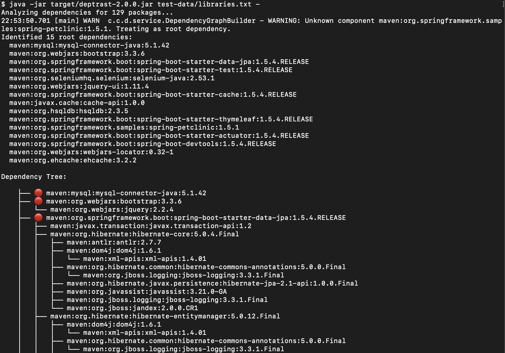

# Deptrast

[](https://github.com/planetlevel/deptrast/actions/workflows/build.yml)

A Java application that constructs a useful *security* dependency tree from a list of components observed at runtime.


Error at the top is expected, it's the <project>.jar which isn't public and can't be looked up.

## Features

- Reads a flat list of all dependencies from a text file
- Fetches dependency information from the deps.dev REST API
- Identifies root dependencies (packages that have no parents)
- Builds a complete dependency graph with parent-child relationships
- Supports output in standard tree format or Maven dependency:tree format
- Uses concurrent API requests for better performance
- Optimized to avoid redundant API calls through intelligent caching
- Supports multiple package ecosystems (Maven, NPM, etc.)

## Example Use

> java -jar target/deptrast-1.0.jar test-data/libraries.txt

## A Note on Resolving Multiple Different Dependency Versions

 Imagine your application has four root dependencies, each of which implies a different version of the target library. Build systems have complex algorithms for choosing the actual version to include in the project. The actual version selected might be any one of the implied versions, or in some circumstances a different version all together.

 For security purposes, deptrast uses the version actually observed at runtime. This is the version that the build system selected. So the deptrast dependency tree will report any vulnerabilities against all four root dependencies.  So, for example, if you have foo-v1, foo-v2, foo-v3, and foo-v4 all in your project, and only foo-v4 observed at runtime, it's likely that the build system selected foo-v4.  Deptrast will report foo-v4 in all of the four root dependency trees.

 For vulnerability purposes, this means that we only report vulnerabilities in the actual executable present at runtime, and not theoretical vulnerabilities in old versions of libraries not present. However, there is a risk that if a change is made to the project that upsets the dependency calculus, some other library would be chosen. For example, if the root dependency of foo-v4 gets updated to remove the need for foo-v4, then the build system might choose foo-v3.  The danger is that foo-v3 might have a vulnerability that is now exposed.

 If needed, we could add a feature to deptrast to keep the original library version.  Post an issue!

## Requirements

- Java 11 or higher
- Maven for building the project

## Building the Project

```bash
mvn clean package
```

This will create an executable JAR file as `target/deptrast-1.0.jar`.

## Usage

```bash
java -jar target/deptrast-1.0.jar <input-file> [max-depth] [--maven-format=<root-project>] [--detailed-report=<output-file>] [--verbose|-v]
```

- `<input-file>`: Path to a file containing all your project's packages (required)
- `[max-depth]`: Optional maximum depth for dependency resolution (default: 25)
- `[--maven-format=<root-project>]`: Optional flag to output in Maven dependency:tree format with the specified root project name
- `[--detailed-report=<output-file>]`: Generate a detailed report of dependency paths and version conflicts
- `[--verbose|-v]`: Enable verbose logging output (disabled by default)

### Input File Format

Each line in the input file should contain a package in the format: `system:name:version`

For Maven packages: `maven:groupId:artifactId:version`
For NPM packages: `npm:packageName:version`

Example:
```
maven:org.springframework.boot:spring-boot-starter-web:3.1.0
maven:com.google.guava:guava:31.1-jre
npm:react:18.2.0
npm:express:4.18.2
```

Lines starting with `#` are treated as comments and ignored.

### Example

```bash
java -jar target/deptrast-1.0.jar libraries.txt
```

This will analyze all packages in `libraries.txt`, determine the root dependencies, and build a dependency tree. Root dependencies will be marked with a red dot (🔴) for easy identification.

### Maven Dependency:tree Format

To output the dependency tree in Maven's format:

```bash
java -jar target/deptrast-1.0.jar libraries.txt --maven-format=my-project
```

This will generate output compatible with Maven's `dependency:tree` command, using 'my-project' as the root node. The Maven format doesn't include the red dot indicators and follows Maven's standard output format.

